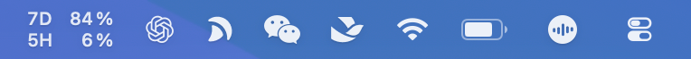
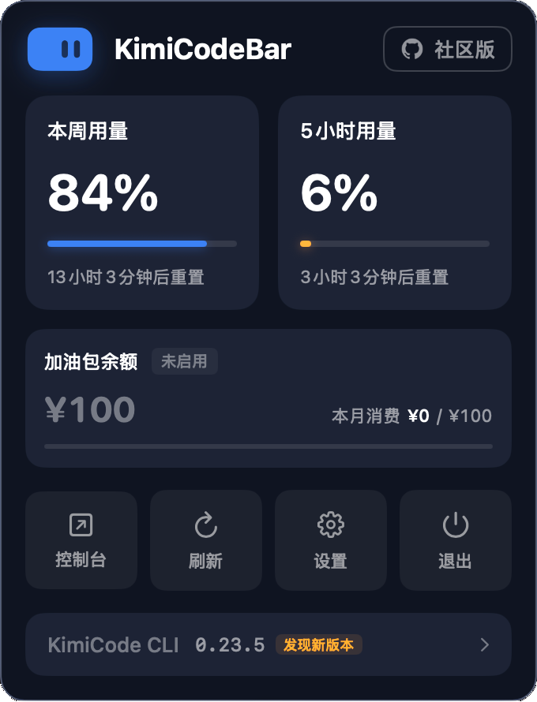
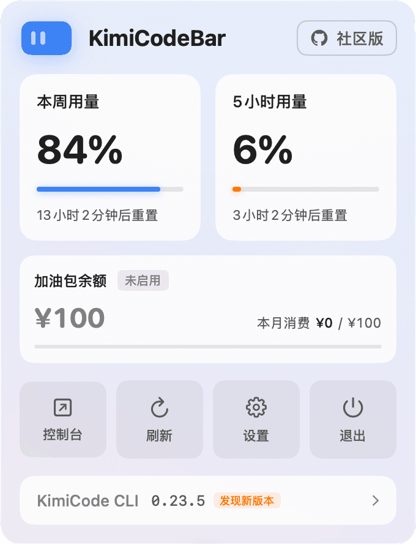
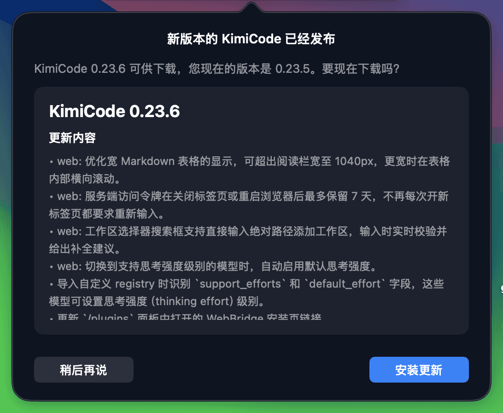
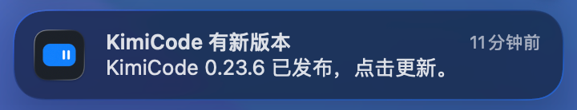

<h1 align="left" style="border-bottom: none; margin: 0">
  &nbsp;&nbsp;KimiCodeBar
</h1>

  
 
  
  

专为 [Kimi Code](https://www.kimi.com/code) 打造的用量监控小工具，在菜单中轻量化运行，限额一目了然！

#

#### 下载安装：<a href="https://github.com/xifandev/KimiCodeBar/releases">GitHub Releases</a>

#### 欢迎提交：<a href="https://github.com/xifandev/KimiCodeBar/issues">Issues</a> 反馈问题或建议

#

### 👇 菜单栏实时监控

### ✨ 菜单栏弹出小面板

  
  

### 🔐 一键授权登录

Kimi 账号浏览器一键授权，免填 Token。凭证与 KimiCode CLI 互通，任一端登录即可，过期自动续期；也保留 API Key 登录方式，可在设置中自由切换。

### ✨ 自动探测 KimiCode 更新

  
 

#

### 🔒 隐私安全

数据仅本地存储，所有 API 只与 Kimi 官方通信，代码全部开源。

#

### 🛠 系统适配

- MacOS（已发布）
- Windows（待开发）

#

### 欢迎提交 👉 <a href="https://github.com/xifandev/KimiCodeBar/issues">Issues</a> 反馈问题或建议

#

###

  
  
